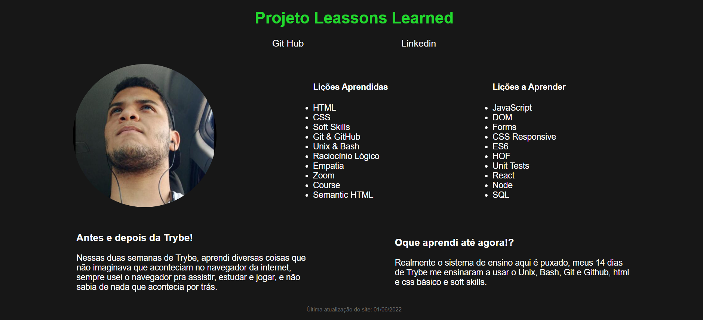

<h1>Olá esse é meu projeto Leassons Learned!</h1>

Esse projeto foi desenvolvido na primeira semana de estudos na trybe!

<h3>Oque eu aprendi?</h3>
<ul>
  <li>Semântica do HTML</li>
  <li>Primeiros passos no CSS</li>
  <li>Como organizar meu site</li>
  <li>Gerenciamento de repositórios do Git Hub</li>
</ul>

Esse projeto foi realizado no dia 26 de novembro de 2021

